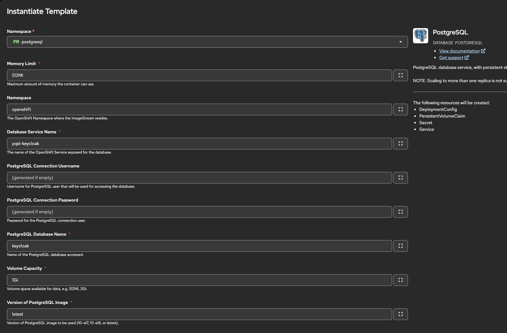

# Setting up LLama Stack on Red Hat Openshift cluster with Red Hat Openshift AI

## Introduction
This document shows how to set up LLama Stack on Red Hat Openshift cluster with Red Hat Openshift AI, specifically for use with AutoRAG feature. It assumes the following set-up will be done:
- single dedicated foundation model
- ingle dedicated embedding model
- Keycloak for authN/authZ and underlying PostgreSQL database
- Llama Stack Server with configuration allowing to run minimal secure AutoRAG scenario (with one foundation and embedding model, using inline Milvus Lite as vector DB, with enabled authN)

## Prerequisites
- installed Red Hat Openshift AI (further named: RHOAI) on Red Hat Openshift (further named: RHOS or OCP) cluster
- ability to log into cluster (via RHOS Console UI and via `oc` as admin)


## Steps

### 1. LLMs and embedding models - computational layer

**1.1. Deploy LLMs and embedding models on vLLM runtime**

You can use link in reference below for the steps to deploy models.

_Reference:_ https://docs.redhat.com/en/documentation/red_hat_openshift_ai_self-managed/3.2/html-single/deploying_models/index#deploying-models-on-the-model-serving-platform_rhoai-user

**1.2. Retrieve routes and tokens to deployed models**

To retrieve URL and token to models:
- go to the project, where models were deployed
- go to `Deployments` tab
- for each target model:
  - to get URLs, click on `Internal and external endpoint` in the row for target model:
    - use `Internal` one for Llama Stack configuration on cluster <--- remember URL for foundation model under `LLM_MODEL_URL`, and URL for embedding model under `EMB_MODEL_URL`
    - use `External` one for any direct communication to the model from outside world
  - to get token, expand the row for target model and get `Token secret` value <--- remember token for foundation model under `LLM_MODEL_TOKEN`, and token for embedding model under `EMB_MODEL_TOKEN`


### 2. PostgreSQL - persistence layer

**2.1. Setup PostgreSQL database instance (for keycloak)**

You can install PostgreSQL instance on RHOAI/RHOS using available template:
- name: `PostgreSQL`
- provider: `Red Hat, Inc.`

As an example, you can use the values from below screenshot, to instantiate PostgreSQL on cluster.


Wait until PostgreSQL instance is ready.

Remember the following values for next steps:
- `PSQL_NS` - from `Namespace`
- `PSQL_SVC` - from `Database Service Name` property
- `PSQL_USERNAME` - from `PostgreSQL Connection Username` property
- `PSQL_PASSWORD` - from `PostgreSQL Connection Password` property
- `PSQL_DB` - from `PostgreSQL Database Name` property

_Reference:_ https://docs.okd.io/latest/applications/creating_applications/using-templates.html


### 3. Keycloak - auth layer

**3.1. Install Keycloak Operator**

You can install Keycloak Operator on RHOAI/RHOS using available operator installer from UI:
- name: `Red Hat build of Keycloak Operator`
- provider: `Red Hat, Inc.`

Wait until operator is ready to operate.


**3.2. Install Keycloak**

Create secret to store PostgreSQL credentials created in previous steps:
```
oc create secret generic keycloak-db-secret \
  --from-literal=username=${PSQL_USERNAME} \
  --from-literal=password=${PSQL_PASSWORD}
```

Create Keycloak resource instance, using previously created secret and pointing to PostgreSQL database, additionally using `openshift-default` ingress controller to create route for us. Use the template under `resources/keycloak.yaml` in order to create Keycloak instance - you can do this either via RHOS Console UI or via `oc` CLI (make sure to substitute all variables `${env.<some_var_expression>...}` in the template before creating resource).

Wait until Keycloak instance is ready.

_Reference:_ https://docs.redhat.com/en/documentation/red_hat_build_of_keycloak/24.0/html/operator_guide/basic-deployment-#basic-deployment-accessing-the-red-hat-build-of-keycloak-deployment


**3.3. Configure Keycloak for Llama Stack usage** 

To configure Keycloak, in this example, we'll use the most basic/minimal configuration that would allow us for integration with Llama Stack. To do so, we need to create & configure:
- realm
- client
- user

**3.3.1 Create/Configure Realm**
To create realm, go to `Manage realms` and click on `Create realm` button. Then:
- in pop-up form, provide `Realm name` <--- remember this under `KEYCLOAK_REALM`
- finalize creation of realm.

**3.3.2 Create/Configure Client**
To create client in realm, go to created realm, then go to `Clients` and click on `Create client` button. Then:
- in `Client authentication` step, provide `Client ID` <--- remember this under `KEYCLOAK_CLIENT`
- in `Capability config` step, enable:
  - `Client authentication`
  - `Authorization`
  - `Direct access grants`
- in `Login settings` step, no changes are required
- finalize creation of client, and proceed to client details panel
- in 'Credentials', get `Client Secret` <--- remember this under `KEYCLOAK_CLIENT_SECRET`

**3.3.3 Create/Configure User**
To create user in realm, go to created realm, then go to `Users` and click on `Add user` button. Then:
- check `Email verified` checkbox
- provide desired `Username` <--- remember this under `KEYCLOAK_USER`
- provide any non-empty Email, First Name and Last Name
- finalize creation of user, and proceed to user details panel
- in 'Credentials', click on `Set password`
- in pop-up form, check off the field with `Temporary password` and input the desired password <--- remember this under `KEYCLOAK_PASS`

**3.3.4 Test token generation**
To test token generation, use the following cURL command:
```
curl -k -d client_id=${KEYCLOAK_CLIENT} -d client_secret=${KEYCLOAK_CLIENT_SECRET} -d username=${KEYCLOAK_USER} -d password=${KEYCLOAK_PASS} -d grant_type=password https://route-keycloak-keycloak.apps.rosa.ai-eng-gpu.socc.p3.openshiftapps.com/realms/${KEYCLOAK_REALM}/protocol/openid-connect/token
```

**NOTE:** You can change lifetime of generated tokens in `Realm Settings -> tab: Sessions` and `Realm Settings -> tab: Tokens`:
- in `Realm Settings -> tab: Tokens`, you need to change either `Access Token Lifespan` <--- this is actual lifetime of generated token
- in `Realm Settings -> tab: Sessions`, you need to change either `SSO Session Max` or `Client Session Max` <--- this needs to be at least equal to `Access Token Lifespan`


### 4. Llama Stack

**4.1. Activate Llama Stack Operator**

Activate Llama Stack Operator by patching existing DataScienceCluster resource from RHOAI.
```
oc patch datasciencecluster <name> --type=merge -p {"spec":{"components":{"llamastackoperator":{"managementState":"Managed"}}}}
```
Replace `<name>` with your DataScienceCluster name, for example, `default-dsc`.

Alternatively, edit DataScienceCluster resource, by adding:
```
llamastackoperator:
      managementState: Managed
```
under `spec.components` key.

_Reference:_ https://docs.redhat.com/en/documentation/red_hat_openshift_ai_self-managed/3.2/html/working_with_llama_stack/activating-the-llama-stack-operator_rag


**4.2. Prepare Llama Stack configuration**

To prepare configuration of LLama Stack, we need to create ConfigMap for it to be consumed. Use the template under `resources/llamastack_configmap.yaml` in order to create ConfigMap for Llama Stack - you should usually do so via `oc` CLI (make sure to substitute all variables `${env.<some_var_expression>...}` in the template before creating resource).


**4.3. Deploy Llama Stack Server**

To deploy Llama Stack Server, we need to create LlamaStackDistribution pointing to previously created ConfigMap. Use the template under `resources/llamastack_dist.yaml` in order to create LlamaStackDistribution resource - you should usually do so via `oc` CLI (make sure to substitute all variables `${env.<some_var_expression>...}` in the template before creating resource).

Wait until Llama Stack Server pod is running.

_References_:
- oauth: https://docs.redhat.com/en/documentation/red_hat_openshift_ai_self-managed/3.2/html/working_with_llama_stack/llama-stack-adv-examples_rag#auth-on-llama-stack_rag


### Test usage

DONE